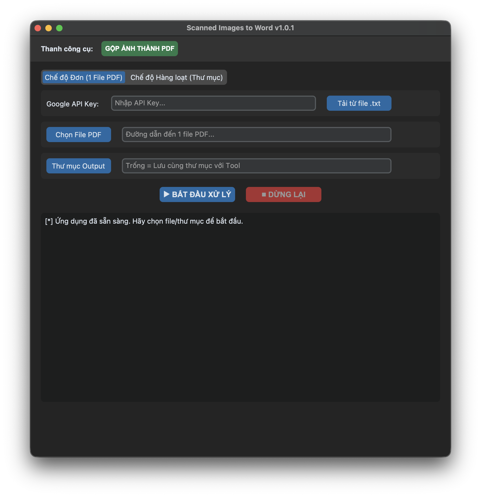

<div align="center">

# 📄 PDFScan2Word

**[🇻🇳 Tiếng Việt](#-tiếng-việt) • [🇺🇸 English](#-english)**


A powerful, AI-driven Desktop application to digitize scanned PDFs & Images into fully formatted Word (`.docx`) documents.  
*Ứng dụng Desktop tích hợp AI giúp chuyển đổi PDF và ảnh quét sang tài liệu Word (.docx) giữ nguyên định dạng.*



</div>

---

## 🇻🇳 Tiếng Việt

### ✨ Tính năng nổi bật
- **Bảo toàn định dạng:** Nhận diện và giữ nguyên cấu trúc bảng biểu, danh sách, định dạng chữ đậm/nghiêng trực tiếp qua PyPandoc.
- **Khôi phục văn bản thông minh:** Sử dụng Google Gemini 3.1 Flash để suy luận và điền chính xác các phần văn bản bị mất do lỗi quét hoặc mép giấy bị che khuất.
- **Giải bài tập bằng AI:** Tự động nhận diện các câu hỏi/bài tập trong tài liệu scan và cung cấp lời giải chi tiết đính kèm cuối văn bản.
- **Xử lý Song song Siêu tốc:** Tự động xử lý cùng lúc nhiều trang PDF để tối ưu hóa thời gian quét.
- **Tùy chỉnh Tốc độ:** 3 mức xử lý (Eco, Balanced, Turbo) giúp tối ưu hóa quota API cho cả tài khoản Free và Paid.
- **Xử lý hàng loạt:** Chuyển đổi toàn bộ thư mục PDF chỉ với một thao tác duy nhất.
- **Hệ thống Cập nhật:** Tích hợp kiểm tra và tải bản cập nhật trực tiếp ngay trong ứng dụng.
- **Công cụ tạo PDF từ ảnh:** Tiện ích gộp, nén và tối ưu hóa các định dạng `.heic`, `.jpg`, `.png` thành một file PDF duy nhất.
- **Xử lý trang đôi:** Tự động nhận diện và cắt đôi các bản quét sách định dạng A5.

### 📜 Nhật ký thay đổi
Để xem chi tiết các thay đổi trong từng phiên bản, vui lòng truy cập trang [Releases](https://github.com/tozn607/pdfscan2word/releases).


### ⚙️ Hướng dẫn cài đặt (Khuyên dùng)
Người dùng thông thường có thể sử dụng ứng dụng ngay mà không cần cài đặt môi trường lập trình:

1. Truy cập trang [Releases](https://github.com/tozn607/pdfscan2word/releases).
2. Tải về phiên bản tương ứng với hệ điều hành:
   - **Windows:** Tải file `.exe` hoặc bản nén `.zip`.
   - **macOS:** Tải bản `.zip` dành cho `Apple Silicon (arm64)` hoặc `Intel (x86_64)`.
3. Giải nén và khởi chạy ứng dụng.
> **Lưu ý cho macOS:** Trong trường hợp hệ thống báo lỗi "app is damaged", vui lòng mở Terminal và chạy lệnh: `xattr -cr /đường-dẫn-đến/PDFScan2Word.app`

### 💡 Hướng dẫn sử dụng
1. **Lấy API Key:** Truy cập [Google AI Studio](https://aistudio.google.com/) để nhận mã API miễn phí.
2. **Cấu hình:** Dán API Key vào ô cấu hình. Key sẽ được mã hóa và lưu trữ tự động cho các lần sau.
3. **Chọn chế độ:**
   - **Single Mode:** Click "Chọn File PDF" để chọn 1 file duy nhất.
   - **Batch Mode:** Click "Thư mục Input" để chọn thư mục chứa nhiều file.
4. **Tùy chọn bổ sung:** 
   - Tích chọn **AI Giải bài tập** nếu muốn AI tự động trả lời câu hỏi trong tài liệu.
   - Tích chọn **Gộp 2 trang** nếu tài liệu là dạng sách chụp trang đôi (A5).
   - Chọn tốc độ (Eco/Turbo) tùy theo loại API Key bạn có.
5. **Xử lý:** Nhấn **START PROCESSING**. File `.docx` kết quả sẽ được lưu cùng thư mục với file gốc (nếu bạn để trống ô Output).

### 💻 Chạy từ mã nguồn
Dành cho lập trình viên muốn tùy chỉnh hoặc phát triển thêm:
```bash
git clone https://github.com/tozn607/pdfscan2word.git
cd pdfscan2word
pip install -r requirements.txt
python main.py
```


---

## 🇺🇸 English

### ✨ Key Features
- **Format Preservation:** Maintains bullet points, numbered lists, bold/italic text, and tables natively in Word using PyPandoc.
- **Smart Text Recovery:** Uses Google's Gemini 3.1 Flash to infer and fill in text cut-off at the page edges—perfect for thick books.
- **AI Exercise Solver:** Automatically detects exercises in the scan and appends worked-out solutions!
- **High-Speed Parallel Processing:** Maximum efficiency by processing multiple PDF pages concurrently.
- **Processing Speed Controls:** 3 selectable tiers (Eco, Balanced, Turbo) to optimize API quota usage for all account types.
- **Batch Processing:** Convert entire folders of PDFs with a single click.
- **Auto-Update System:** Built-in version management and easy update notifications.
- **Image to PDF Maker:** Built-in utility to merge, compress, and enhance `.heic`, `.jpg`, `.png` into a single PDF.
- **Left-Right Page Splitting:** Intelligent processing for A5 book spreads.

### 📜 Release Notes
To see a detailed list of changes for each version, please visit the [Releases](https://github.com/tozn607/pdfscan2word/releases) page.


### ⚙️ Quick Installation (Recommended)
You don't need to know Python to use this app. Just download the pre-built application:

1. Go to the [Releases](https://github.com/tozn607/pdfscan2word/releases) page.
2. Download the version for your OS:
   - **Windows:** Download the `.exe` or `.zip` for Windows.
   - **macOS:** Download the `.zip` for `Apple Silicon (arm64)` or `Intel (x86_64)`.
3. Extract and run!
> **macOS Quarantine Note:** If macOS prevents the app from opening by saying "app is damaged", open Terminal and run: `xattr -cr /path/to/extracted/PDFScan2Word.app`

### 💡 How to Use
1. **Get API Key:** Obtain a free key from [Google AI Studio](https://aistudio.google.com/).
2. **Setup:** Paste your API Key into the configuration field. It will be encrypted and saved locally for future use.
3. **Select Mode:**
   - **Single Mode:** Click "Select PDF" to process one specific document.
   - **Batch Mode:** Click "Input Folder" to convert an entire directory of PDFs.
4. **Configure Options:**
   - Enable **AI Solves Exercises** to have Gemini automatically answer questions found in the document.
   - Enable **Merge 2 pages** for A5 book spreads (two pages on one scan).
   - Adjust **Processing Speed** based on your API limits (Eco for free, Turbo for paid).
5. **Convert:** Click **START PROCESSING**. The resulting `.docx` file will be auto-saved in the same directory as the input (unless a custom Output folder is specified).

### 💻 Running from Source
If you are a developer and want to run it from the code:
```bash
git clone https://github.com/tozn607/pdfscan2word.git
cd pdfscan2word
pip install -r requirements.txt
python main.py
```


---

### ❤️ Credits
- UI Framework: [CustomTkinter](https://github.com/TomSchimansky/CustomTkinter)
- AI Engine: [Google Generative AI (Gemini)](https://ai.google.dev/)
- Formatting Engine: [Pandoc](https://pandoc.org/)
- PDF Backend: [PyMuPDF](https://pymupdf.readthedocs.io/)

### 📜 Giấy phép (License)
Dự án được phát hành dưới giấy phép mã nguồn mở [MIT License](LICENSE).