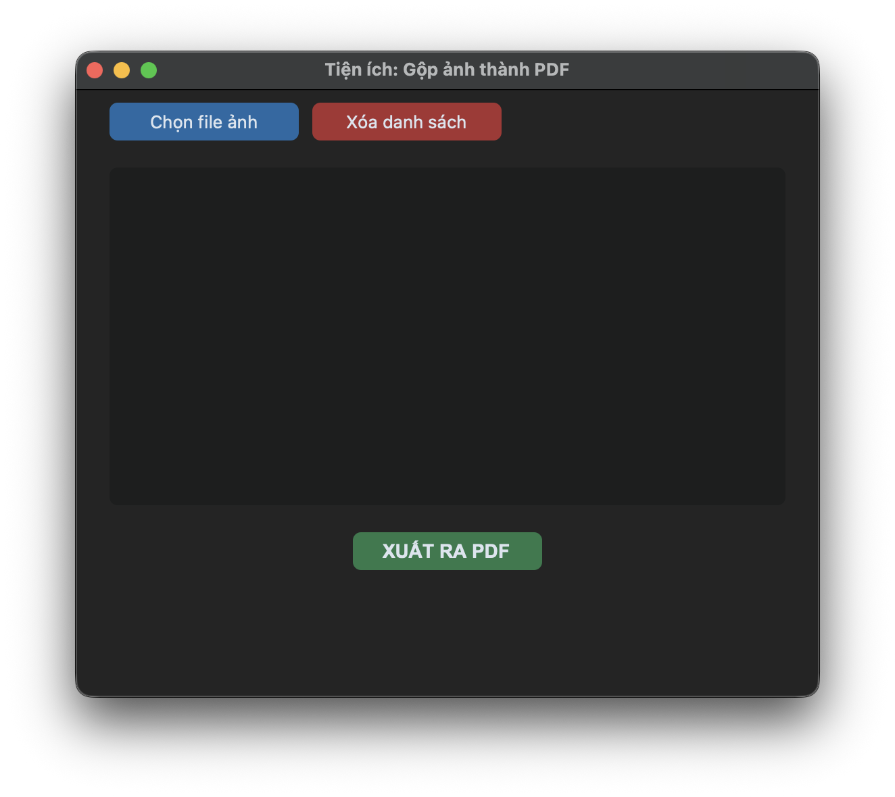

# 📄 PDF to Word OCR

Một ứng dụng Desktop mạnh mẽ giúp chuyển đổi các tài liệu PDF dạng scan hoặc hình ảnh sang định dạng Word (.docx) mà vẫn **giữ nguyên cấu trúc định dạng gốc** (bảng biểu, in đậm, in nghiêng, danh sách). 

Khác với các công cụ OCR truyền thống (như Tesseract) thường làm mất định dạng và nối dòng lộn xộn, phần mềm này ứng dụng mô hình AI Đa phương thức (Google Gemini 3.1 Flash) để "đọc hiểu" ngữ cảnh trang giấy, khôi phục cấu trúc và xuất ra file Word hoàn chỉnh.

## ✨ Tính năng nổi bật
- **Bảo toàn định dạng (Formatting):** Nhận diện chính xác và giữ nguyên các gạch đầu dòng, danh sách đánh số, đoạn văn bản in đậm/in nghiêng và bảng biểu.
- **Phục hồi văn bản thông minh:** AI tự động suy luận và điền bù các chữ bị khuất ở mép gáy sách — cực kỳ hữu ích khi số hóa các giáo trình đại học dày đặc, tài liệu luật pháp, hoặc các văn bản triết học.
- **Xử lý hàng loạt (Batch Processing):** Quét toàn bộ một thư mục chứa hàng chục file PDF và tự động xuất ra file Word tương ứng chỉ với 1 cú click.
- **Tiện ích gộp ảnh:** Tích hợp sẵn công cụ chọn nhiều file ảnh (.jpg, .png) và đóng gói thành 1 file PDF duy nhất.
- **Tự động cập nhật (Auto-update):** Thông báo ngay trên giao diện khi có phiên bản mới nhất từ GitHub.

## 📸 Ảnh chụp màn hình


*Giao diện làm việc với chế độ Đơn và Hàng loạt*


*Tiện ích gộp ảnh thành PDF*

## ⚙️ Yêu cầu hệ thống (Prerequisites)
Để chạy từ mã nguồn (Source code), máy tính của bạn cần cài đặt:
1. **Python 3.8** trở lên.
2. **Poppler**: Công cụ lõi dùng để chuyển PDF thành ảnh (pdf2image).
3. **Pandoc**: Công cụ lõi dùng để dịch Markdown sang Word (.docx).

## 🚀 Hướng dẫn Cài đặt

### Bước 1: Tải mã nguồn
```bash
git clone https://github.com/tozn607/pdfscan2word.git
cd pdfscan2word
```

### Bước 2: Cài đặt thư viện Python
```bash
pip install -r requirements.txt
```

### Bước 3: Cài đặt công cụ hệ thống (Quan trọng)

**🍎 Dành cho macOS:**
Bạn có thể dễ dàng cài đặt Poppler và Pandoc qua Homebrew:
```bash
brew install poppler pandoc
```

**🪟 Dành cho Windows:**
1. **Poppler:** - Tải bản Release mới nhất của Poppler cho Windows tại [Release page](https://github.com/oschwartz10612/poppler-windows/releases/).
   - Giải nén vào ổ C (Ví dụ: `C:\poppler`).
   - Thêm đường dẫn thư mục `bin` (Ví dụ: `C:\poppler\Library\bin`) vào biến môi trường **PATH** của Windows.
2. **Pandoc:**
   - Tải file `.msi` cài đặt từ [trang chủ Pandoc](https://pandoc.org/installing.html) và tiến hành cài đặt bình thường.

## 💡 Hướng dẫn Sử dụng
1. Khởi chạy ứng dụng:
   ```bash
   python bot_gui.py
   ```
2. Lấy API Key miễn phí từ [Google AI Studio](https://aistudio.google.com/) và dán vào ô **Google API Key**. Phần mềm sẽ tự động lưu lại key này cho những lần mở sau.
3. Chọn chế độ làm việc: **Đơn (1 file)** hoặc **Hàng loạt (Thư mục)**.
4. Chọn đường dẫn Input và Output. Nếu để trống Output, file Word sẽ được lưu cùng vị trí với thư mục gốc của bạn.
5. Bấm **Bắt đầu xử lý** và theo dõi tiến trình trực tiếp trên màn hình Log.

## 📦 Hướng dẫn Build (Đóng gói thành App)
Nếu bạn muốn đóng gói mã nguồn thành một file thực thi duy nhất (`.app` cho Mac hoặc `.exe` cho Windows) để mang đi máy khác chạy không cần cài Python:

1. Cài đặt thư viện đóng gói:
   ```bash
   pip install pyinstaller
   ```

2. Chạy lệnh Build:
   ```bash
   pyinstaller --noconsole --windowed --onefile --collect-all customtkinter --name PDFScan2Word main.py
   ```

   
3. Lấy file thành phẩm trong thư mục `dist/`.

> **Lưu ý trên Windows:** File `.exe` sau khi build vẫn yêu cầu máy tính chạy nó phải có sẵn **Poppler** và **Pandoc** trong hệ thống để hoạt động bình thường.

## 🤝 Đóng góp (Contributing)
Mọi đóng góp để cải thiện ứng dụng đều được hoan nghênh! Vui lòng tạo *Pull Request* hoặc mở *Issue* để báo lỗi hoặc đề xuất tính năng.

## 📜 Giấy phép (License)
Dự án này được phân phối dưới giấy phép MIT License.

## ❤️ Credits
- Giao diện được xây dựng bằng [CustomTkinter](https://github.com/TomSchimansky/CustomTkinter).
- Lõi nhận diện AI sử dụng [Google Generative AI (Gemini)](https://ai.google.dev/).
- Lõi chuyển đổi văn bản được xử lý bởi [Pandoc](https://pandoc.org/).